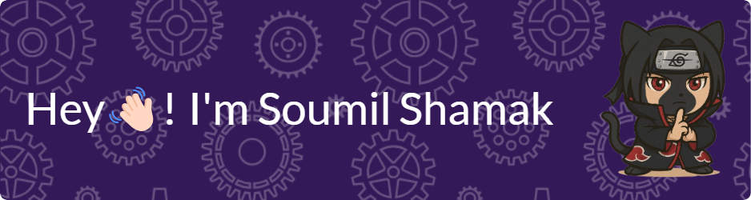

<!-- Header Image -->

    

<ul>
  <li>  
    
Hey👋! I'm <b>Soumil Shamak</b> a <b>Computer Science and Engineering</b> student from <b>Vellore Institute of Technology</b>, Bhopal with a passion for <b>Full Stack Development</b> and <b>Artificial Intelligence</b>.

  </li>
  <li>
    
Beyond coding, I'm committed to continuous learning and enjoy tackling real-world problems through tech. My expertise spans <b>Django</b>, <b>HTML</b>, <b>CSS</b>, <b>Bootstrap</b>,<b>JavaScript</b>,<b>Git</b> and <b>REST APIs</b>. I'm also diving into Machine Learning and starting my journey with Flutter for the cross-platform app. I'm also exploring other tech stacks like MERN.

  </li>
  <li>
    
If you're interested in collaborating, feel free to <a href="https://www.linkedin.com/in/soumil-shamak" target="_blank">connect!</a>📥

  </li>
</ul>

  

 

  

 

    
    
    
    

 

<table width="100%" align="center">
  <tr>
    <td colspan="2" align="center">
      
    </td>
  </tr>
  
  <tr>
    <td align="center" width="50%">
      
    </td>
    <td align="center" width="50%">
      
    </td>
  </tr>
</table>

 

<!-- Footer -->

    

